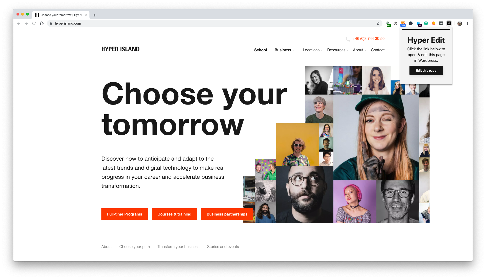

# 📝 hyper-edit

Makes opening the Wordpress edit page blazing fast 🔥

Click the HI icon and then click on the edit button to open the Wordpress editor page.

Only runs on `hyperisland.com` pages.

## about

Hyper Island has a lot of web pages and making edits to a specific page can take ages. Finding the page, searching for it in Wordpress, opening it, etc can take 30-60 seconds. With this extension, you can open the page directly; blazing fast 🔥

## install

Now available on the [Chrome app store](https://chrome.google.com/webstore/detail/hyper-edit/kecfiillgmfoccimdbndgdkolpghboom).

## thanks

Thanks to [Simon Busborg](https://codepen.io/simonbusborg/pen/cyxad?editors=1100) for the CSS and [Kyle Robinson Young](https://www.youtube.com/watch?v=Ipa58NVGs_c) for the tutorial help.
