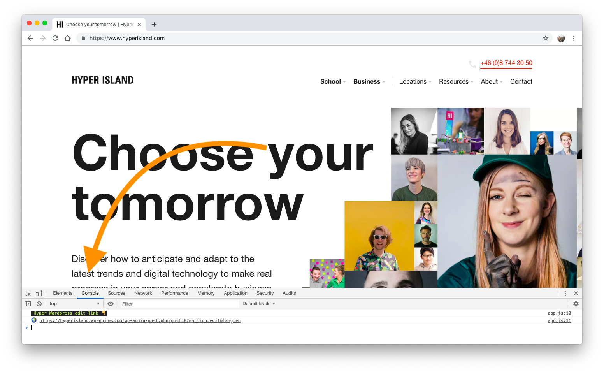

# hyper-edit 📝

Makes opening the Wordpress edit page even faster.

Press `alt + cmd + i` to open the dev console, and click the console tab to find the editor link.

Only runs on `hyperisland.com` pages.

## install

1. Download this repo as a .zip file (green button 👉 Download as zip)
2. Go to `chrome://extensions/` and check the box for Developer mode in the top right
3. Locate the ZIP file on your computer and unzip it
4. Click the Load unpacked extension button and select the unzipped folder for your extension to install it

## new version

1. Right click the HI logo and click "Remove from Chrome"
2. Follow the install steps again

## screenshot

The extension works by dropping the edit link into the Chrome developer console. Just click the link to open the edit page.

Click this screenshot to see a tutorial video.

